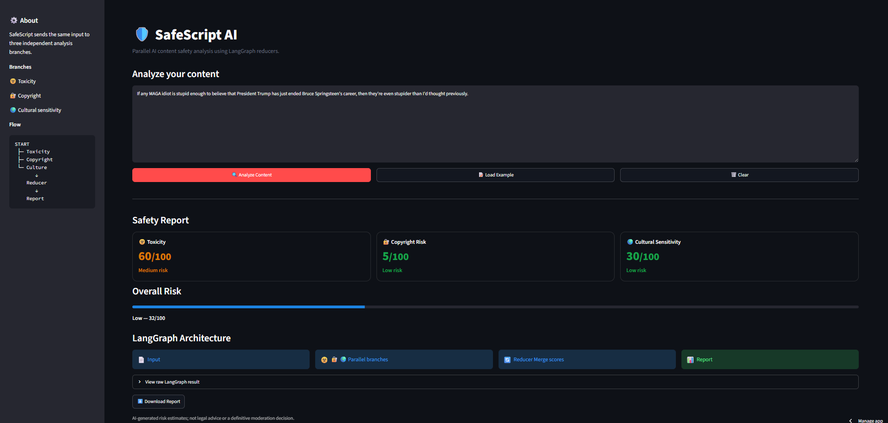

# 🛡️ SafeScript AI — AI Content Safety Analyzer

**Important References**


[](https://ai-content-safety-analyzer-dumhamdjng378vfzzmudal.streamlit.app/)
[](https://github.com/rajputshivamsingh510/ai-content-safety-analyzer)
[](https://www.langchain.com/langgraph)
[](https://fastapi.tiangolo.com/)


* 🌐 **Live Demo:** [https://ai-content-safety-analyzer-dumhamdjng378vfzzmudal.streamlit.app/](https://ai-content-safety-analyzer-dumhamdjng378vfzzmudal.streamlit.app/)
* 💻 **GitHub:** [https://github.com/rajputshivamsingh510/ai-content-safety-analyzer](https://github.com/rajputshivamsingh510/ai-content-safety-analyzer)

* <p align="center">  </p>

## 🌳 Project Tree

```text
ai-content-safety-analyzer/
│
├── app.py
│   └── Streamlit UI + application entry point
│
├── parallel_reducers.py
│   └── LangGraph parallel analysis workflow
│
├── requirements.txt
│   └── Project dependencies
│
├── .env.example
│   └── Groq API key template
│
├── .gitignore
│   └── Secrets, virtual environment & cache exclusions
│
└── README.md
```

## ⚙️ Processing & Functioning

```text
                    USER INPUT
                        │
                        ▼
                 ┌─────────────┐
                 │   LangGraph │
                 │    State    │
                 └──────┬──────┘
                        │
          ┌─────────────┼─────────────┐
          │             │             │
          ▼             ▼             ▼
   ┌────────────┐ ┌────────────┐ ┌────────────┐
   │  Toxicity  │ │ Copyright  │ │  Cultural  │
   │  Analyzer  │ │  Analyzer  │ │  Analyzer  │
   └─────┬──────┘ └─────┬──────┘ └─────┬──────┘
         │              │              │
         ▼              ▼              ▼
      0–100          0–100          0–100
         │              │              │
         └──────────────┼──────────────┘
                        ▼
                ┌───────────────┐
                │    Reducer     │
                │  Merge Scores  │
                └───────┬───────┘
                        ▼
                ┌───────────────┐
                │ Safety Report │
                └───────────────┘
```

### 1. User Input

The user enters a script, tweet, article, or other text through the Streamlit interface.

### 2. LangGraph State

The input is stored in the shared `AnalyzerState`:

```text
raw_text
safety_scores
```

### 3. Parallel Analysis

The same input is analyzed independently by three LangGraph nodes:

* **Toxicity Analyzer** → `toxicity_level`
* **Copyright Analyzer** → `copyright_risk`
* **Cultural Analyzer** → `cultural_insensitivity`

Each produces a **0–100 risk score**.

### 4. Reducer

The three branches write to the shared `safety_scores` state.

The reducer merges them:

```json
{
  "toxicity_level": 72,
  "copyright_risk": 41,
  "cultural_insensitivity": 23
}
```

### 5. Final Report

Streamlit displays the individual scores and calculates an overall risk score.

### 🔑 Core Concept

> **One input → parallel LangGraph analysis → shared-state reducer → unified safety report.**

This project primarily demonstrates **parallel execution and state merging with LangGraph**.
